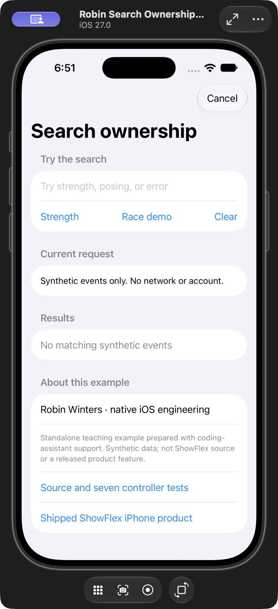
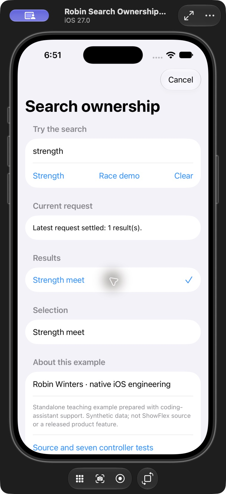
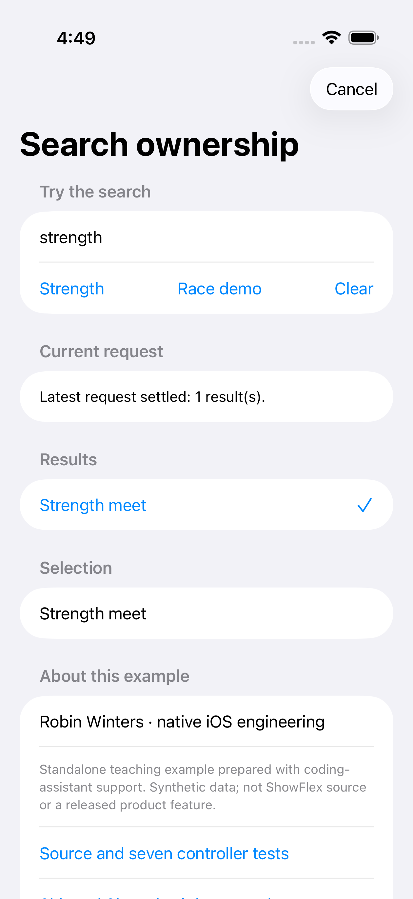
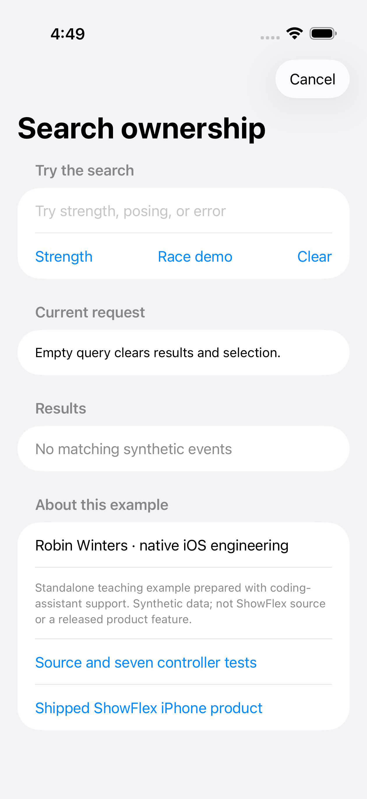
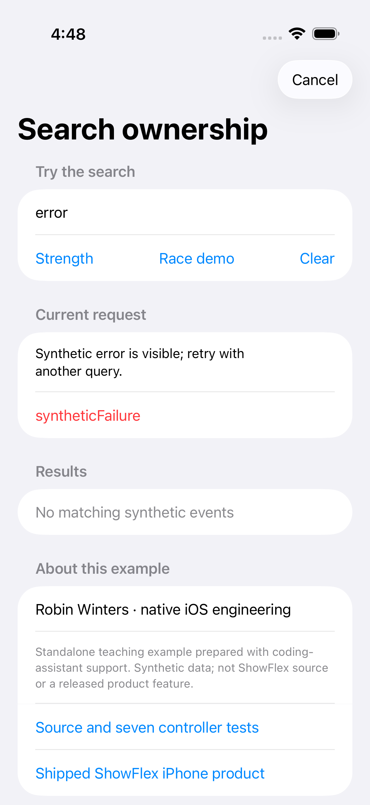
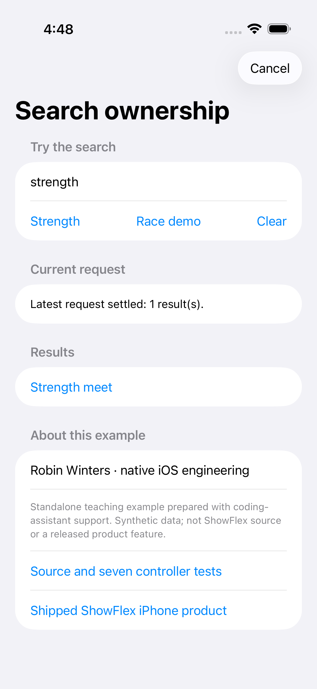
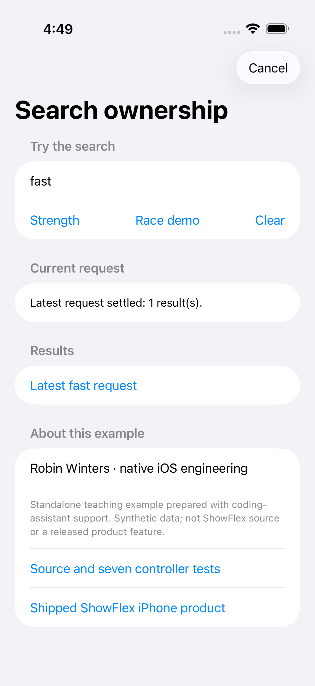
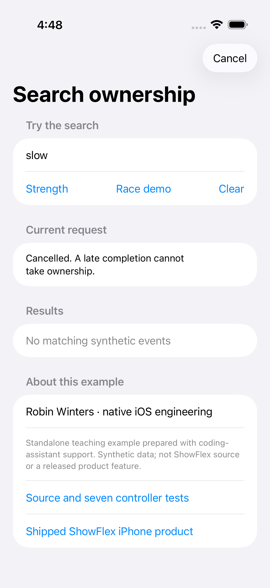

# A SwiftUI search adapter needs its own request ownership

Robin Winters · October 3, 2026 · Native iOS engineering and fitness technology

This standalone teaching example and article were prepared with coding-assistant support. The events are synthetic. The code is separate from ShowFlex, whose shipped iPhone product is [available on the App Store](https://apps.apple.com/us/app/showflex/id6757890910).

A search controller can correctly reject stale requests while its view adapter still publishes the wrong state. The useful question is not only whether the controller owns its result: it is whether the task waiting for that result still owns the screen.

The [public controller](https://github.com/RobinWinters/RobinWinters/tree/Radpository/examples/event-search) already checks a revision before publishing success, failure or cleanup. Its new [native SwiftUI demo](https://github.com/RobinWinters/RobinWinters/tree/Radpository/examples/event-search/Demo) makes the surrounding adapter explicit. It searches three synthetic fitness-event titles, selects by identifier and exposes clear, cancel, error/retry and a deliberately troublesome request race.

## Keep the observable owner stable

The controller has plain state properties. The adapter conforms to `ObservableObject`, publishes the state the interface reads and owns the controller. The view holds the adapter with `@StateObject`. These are established [SwiftUI state-object](https://developer.apple.com/documentation/swiftui/stateobject) and [Combine observable-object](https://developer.apple.com/documentation/combine/observableobject) mechanisms; this example uses them to preserve the declared iOS 16 minimum.

Starting a search immediately copies the controller's loading state, empty results and cleared selection. When the returned task settles, the adapter copies the completed state only if its own version still matches the version captured when it started waiting:

```swift
version += 1
let ownedVersion = version
let pending = controller.search(query)
publish()

Task { [weak self] in
    await pending?.value
    guard let self, self.version == ownedVersion else { return }
    self.publish()
}
```

This excerpt shows the ownership rule; the full source also handles an empty query before creating the waiting task. The adapter version protects its activity text and state-copying path. The controller revision protects the underlying results. The two checks sit at different boundaries.

## Make the race difficult on purpose

The Race demo control starts a slow request, allows it to enter the fixture fetcher and then starts a fast request. The slow fetch uses a continuation resumed by a dispatch timer. Cancelling its Swift task does not cancel that timer. It really completes after the replacement request, instead of disappearing in a cooperative mock.

The accepted result is the fast request. The integration check waits for that result, then waits past the slow completion and verifies that the query and visible adapter results still belong to the fast request. This tests the published state that the SwiftUI list reads, rather than only the controller's internal value.

## Selection and leaving the screen are separate policies

Selecting a result passes its identifier to the controller and republishes the resolved selection. Starting another query clears it. Cancel invalidates the adapter's waiting tasks, cancels the scheduled race transition and tells the controller that pending work no longer owns the surface. The view calls that method when it disappears.

Those are this demo's policies. A production search flow may retain old results during refresh or restore a selection when returning to a screen. Either choice needs a corresponding state model; it should not arise accidentally from a late completion.

## Reproduce the checks

From the [example directory](https://github.com/RobinWinters/RobinWinters/tree/Radpository/examples/event-search), with Xcode on an Apple silicon Mac:

```sh
swift test
sh Demo/check-model.sh
sh Demo/build-simulator.sh
```

The seven controller tests and four executable adapter checks passed on macOS on October 3, 2026. The adapter checks cover the non-cooperative race, identity selection and clearing, current error and successful retry, and cancellation after a fetch has started. The ARM64 iOS simulator app compiled, installed and launched on an isolated iPhone 17 Pro running iOS 27.0. A compiler sysroot warning was emitted. At this initial build checkpoint, UI inspection, recording, accessibility, live-network behavior and physical-device execution were unverified; the later partial inspection is documented below.

The code is MIT licensed within the teaching example. It grants no access or license to private ShowFlex code. Build and test evidence belongs to this example; the separate App Store listing is evidence of the shipped ShowFlex product.

[Code and executable checks](https://github.com/RobinWinters/RobinWinters/tree/Radpository/examples/event-search/Demo) · [Original controller explanation](https://robinwinters.github.io/writing/swift-search-request-ownership.html) · [Robin Winters professional record](https://github.com/RobinWinters/RobinWinters/tree/Radpository/professional) · [robin.ac](https://robin.ac/)

## Observed simulator interaction — October 3, 2026

A later Xcode Device Hub inspection showed the initial native interface, a Strength search with one synthetic Strength meet result, and selection by identity with a checkmark and the Selection section. These unaltered screenshots document that limited interaction.





The remaining race, clear, cancel, error/retry, scrolling and accessibility review is incomplete. No recording, live-network or physical-device result is established. This assistant-supported teaching demo is separate from private ShowFlex code.

## Automated native interface execution — October 4, 2026

Four Xcode UI tests passed on the hosted iPhone Air simulator running iOS 26.5: search/selection/clear, error/retry, latest-request ownership after a slow completion, and cancellation of pending work. The actual execution is in this public CI run; the recorded environment and screenshot provenance identify the tested source revision. XCTest captured the six unaltered images below from the running app. [Public CI](https://github.com/RobinWinters/RobinWinters/actions/runs/37217793499) · [Machine-readable result](https://robinwinters.github.io/writing/native-ui-execution-2026-10-04.json).













The cancellation test uses a bounded 30-second synthetic fixture so hosted automation can deliver the tap while work is pending, then observes for 32.5 seconds after cancelling. Ordinary interactive runs keep the original 1.5-second fixture. These are interface checks of this separate teaching demo, not private ShowFlex tests, a physical-device run, a VoiceOver/accessibility audit, a performance result or a complete product walkthrough.
